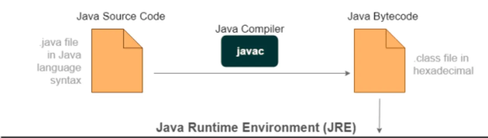
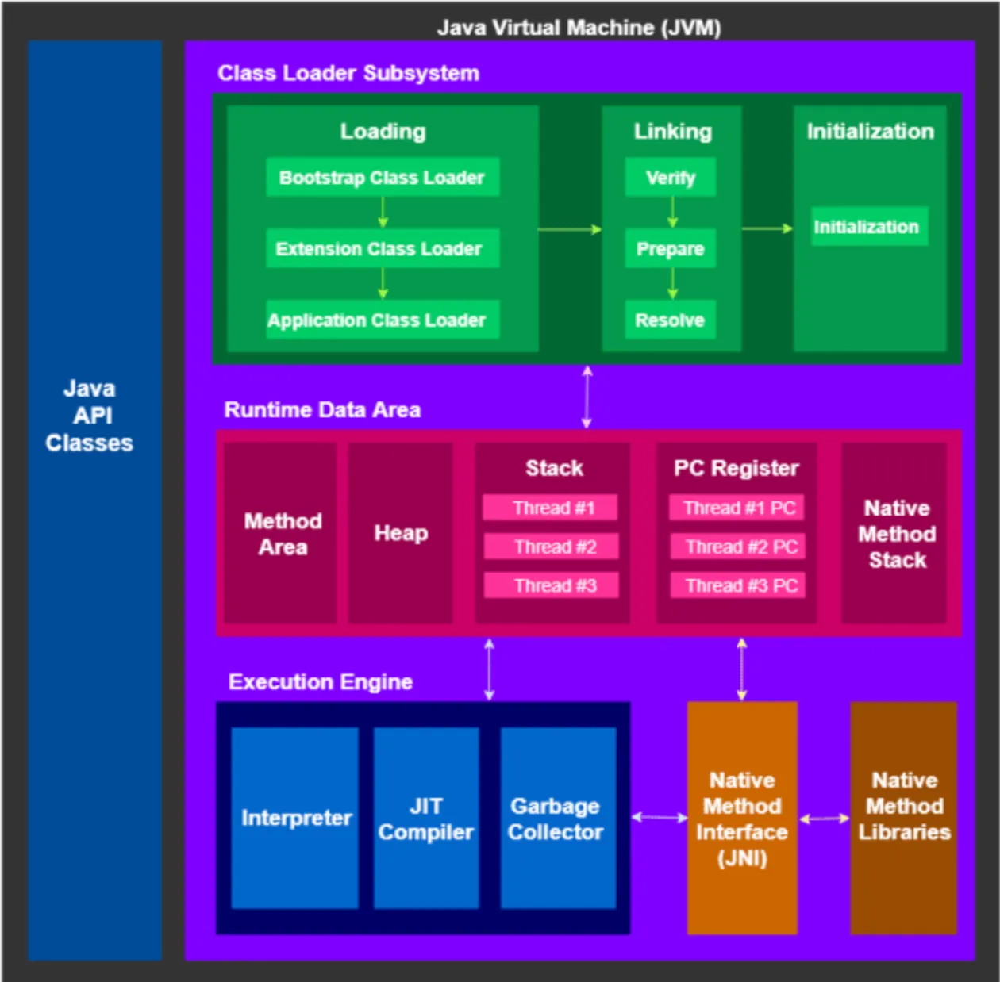
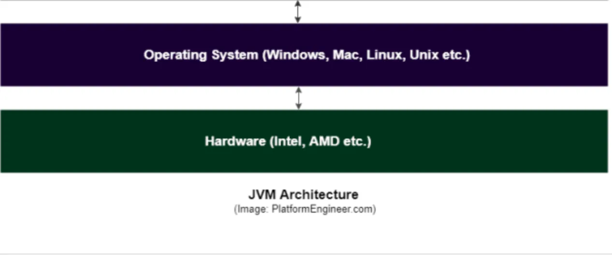

### About JVM(Java Virtual Machine)

**JVM**(Java Virtual Machine)은 “자바 바이트코드(.class)를 어떤 운영체제/CPU 위에서도 동일하게 실행”시키는 **가상 실행 환경**입니다.  

자바 프로그램은 OS나 CPU의 실제 명령어가 아니라 **바이트코드**로 배포되고, 각 플랫폼에 설치된 JVM이 그 바이트코드를 해석(Interpreter) 또는 **JIT** 컴파일해 실제 하드웨어에서 돌려 줍니다.

이 설계 덕분에 자바의 정신인 “**Write once, Run anywhere**”가 성립합니다.  

---

### **왜 자바는 “하이브리드형 언어”인가?**

**컴파일형(C, C++ 등)**

- 소스 → 컴파일러 → **플랫폼 종속적인 기계어 실행 파일**
- 런타임 비용이 낮고 빠름, 그러나 플랫폼 마다 별도의 빌드가 필요함.

**인터프리터형(Python)**

- 소스 → 인터프리터가 즉시 해석 실행
- 편의성 높음, 그러나 느림

**하이브리드형(Java)**

- 소스(.java) → javac 컴파일 → 바이트코드(.class/.jar)
- 실행 시 JVM이 **해석(Interpreter)** + **JIT(Just-In-Time) 컴파일**을 통해 **플랫폼별 네이티브 코드**로 동적 변환
- 바이트 코드로 공통 빌드, 실행 성능은 JIT 최적화
- 컴파일, 인터프리터형의 장점만 결합

### JIT은 어떻게 최적화 하는가?

- 자주 실행되는 코드 경로(`핫스팟`)를 찾아 런타임에 네이티브 코드로 컴파일하면서 최적화.

### JNI (Java Native Interface)
- 자바에서 C/C++로 작성된 네이티브 라이브러리를 호출하는 인터페이스
- 성능이 중요한 부분을 네이티브 코드로 작성하여 자바 애플리케이션에서 사용할 수 있게 함.
- 플랫폼 종속적인 코드를 자바에서 사용할 수 있게 해줌.

### GC (Garbage Collection)
- JVM이 자동으로 메모리를 관리하는 기능
- 더 이상 참조되지 않는 객체를 자동으로 식별하고 메모리에서 해제하여 메모리 누수를 방지
- 개발자가 직접 메모리를 해제할 필요가 없음.

### JDK (Java Development Kit)
- 자바 개발 도구 모음
- 컴파일러(javac), 디버거(jdb), 문서 생성기(javadoc) 등 개발에 필요한 도구 포함
- JRE 포함
- 자바 애플리케이션 개발에 필수

### JRE (Java Runtime Environment)
- 자바 애플리케이션 실행 환경
- JVM, 자바 클래스 라이브러리, 자바 실행 도구 포함
- 자바 애플리케이션 실행에 필요
- 개발 도구는 포함하지 않음
- JDK에 포함되어 있음

### JVM (Java Virtual Machine)
- 자바 바이트코드를 실행하는 가상 머신
- 플랫폼 독립적인 실행 환경 제공
- 메모리 관리, 스레드 관리, 예외 처리 등 다양한 기능 제공
- JRE에 포함되어 있음
- 자바 애플리케이션 실행의 핵심 구성 요소
- 각 운영체제별로 구현체가 다름 (예: HotSpot, OpenJ9 등)

---

Java 9 이후에는 JRE가 별도로 설치 안하고, JDK안에 런타임 환경이 통합되었다.  
따라서 JDK 설치하면 JRE까지 같이 설치된다.

