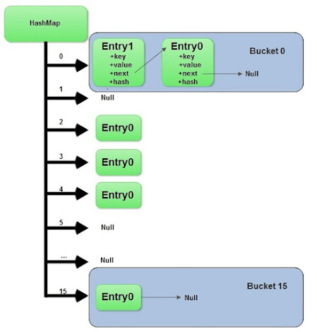
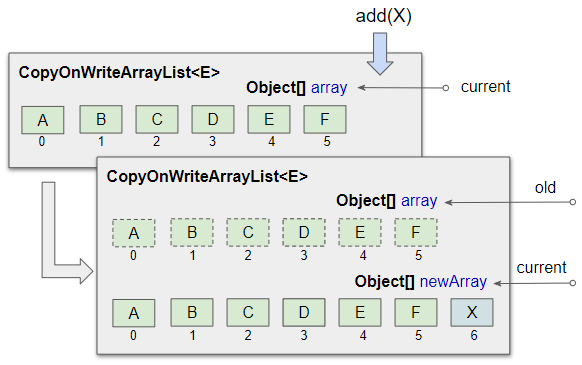
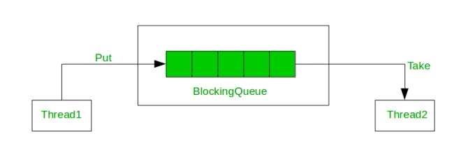
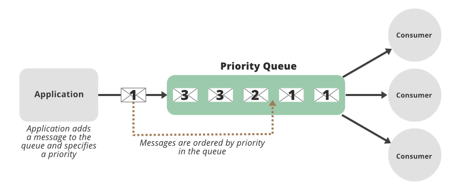
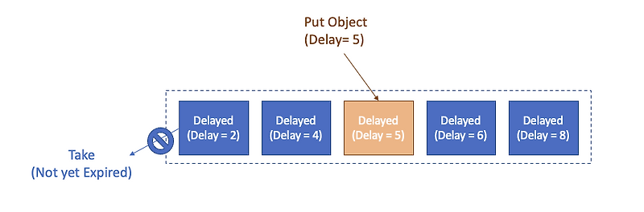

## 자바의 동시성 컬렉션


### 동시성 컬렉션
1.  **뜻**: 스레드 세이프 컬렉션
2. **장점**: 
- 성능 최적화 기법이 내부에서 적용됨. 
  - 동시성 컬렉션은 synchronized 컬렉션보다 락 범위를 세분화해 성능을 높임
---

### ConcurrentHashMap
1.  **특징**:
- 동시성 제어:
  - 여러 스레드가 동시에 데이터 삽입, 삭제 시 안전하게 동작


- 락 분할(Lock Striping):
  - 전체 맵을 여러 개의 락으로 나눔
  - 버킷:
      - 락의 단위
      - 하나의 버킷에는 하나 이상의 엔트리(key-value 쌍)
  - 버킷에 접근하면 해당 버킷만 lock을 하고 다른 전체 데이터 구조는 잠그지 않는 방식
  

2. **코드**:
```java
ConcurrentMap<String, Integer> map = new ConcurrentHashMap<>();
```
---
### CopyOnWriteArrayList
1.  **특징**:
- 읽기-쓰기 분리:
  - 읽기: 락 없이 수행
  - 쓰기: 락 O, 내부 배열을 복사하여 새로운 배열을 만들어 수행
- 데이터의 불변성
  - 쓰기 작업이 발생할 때마다 새로운 배열 생성
- 성능:
  - 읽기 작업 속도 빠름
  - 읽기 작업이 빈번하고 쓰기 작업이 적은 경우에 효율적
    
2. **코드**:
```java
List<String> list = new CopyOnWriteArrayList<>();
```

---
### BlockingQueue
1.  **특징**:
- 쓰레드 간 통신:
  - 생산자-소비자 패턴에서 주로 사용
- 블로킹 연산:
  - 큐가 가득 찼거나 비어있을때 블록

2. **구현체 & 크기 제어**
- **ArrayBlockingQueue**: 고정 크기 → 생산자-소비자 패턴의 한정된 버퍼
  

- **LinkedBlockingQueue**: 추가/제거 시 노드 단위로 크기 변화 → 스레드 풀 작업 큐
- **PriorityBlockingQueue**: 필요 시 크기 2배 확장, 자동 축소 없음 → 작업 우선순위 처리
  
- **DelayQueue**: 필요 시 크기 2배 확장, 자동 축소 없음 → 일정 시간 후 처리
  

---
### 참고문헌:
https://velog.io/@dongvelop/thread-safe-collection#8-%EB%8F%99%EC%8B%9C%EC%84%B1%EC%97%90-%EC%95%88%EC%A0%84%ED%95%9C-%EC%BB%AC%EB%A0%89%EC%85%98


https://simgee.tistory.com/36#Lock%20Striping-1-3